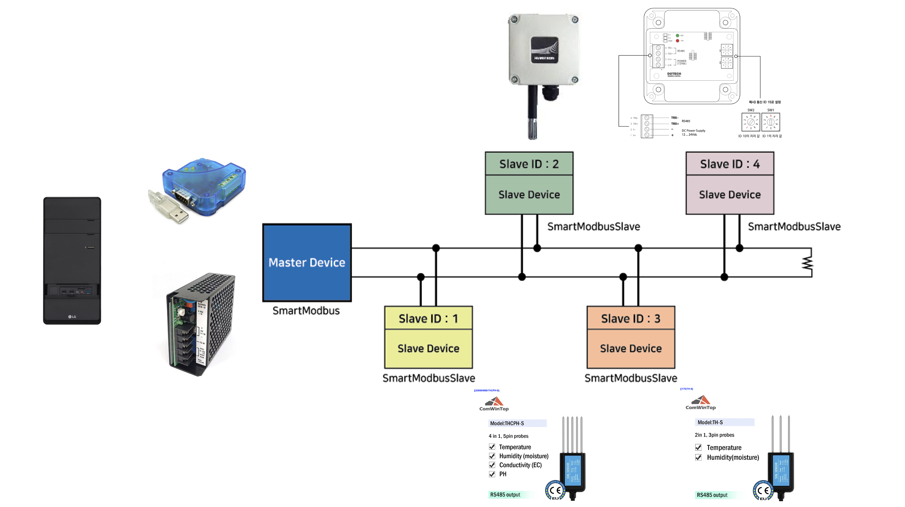

Single-phase 2-wire

Three-phase 4-wire

4선식 + Master-Slave 구조와 "단계 전압 차단" 원리
당신이 언급한 이 구조는 전형적인 스마트 파워 제어 시스템의 모델이에요.
4선식 구성
일반적으로는 전원(+), 접지(-), 데이터(+/-) 또는 제어선 등으로 구성됩니다.
→ 제어선이 있어야 Master가 Slave의 상태를 읽고 판단할 수 있음.
단계적 전압 공급과 작동 조건
당신 말처럼 "전압만 올리는 게 아니라", Slave가 실제 전류를 요구(=회로가 닫힘) 할 때 전류가 흐르고, 그때 Master는 다음 단계로 진행하지 않음.
즉, "작동하면 그 선에서 멈추고, 다음에는 전압을 공급하지 않음"은 맞는 추론입니다.
이는 “전류 감지 기반 전압 공급 차단 메커니즘”으로 설명되며, 대표적으로 PD Negotiation에서 기기가 원하는 Voltage Profile을 선택하는 구조와 유사합니다.

Smart IC / Power Management IC 원리
Smart IC는 각 포트의 연결 상태(전압/전류/부하 상태)를 실시간 모니터링합니다.
전체 어댑터의 전력 한도 내에서, 어떤 포트에 우선 전력을 배분할지 결정합니다.
사용 중인 기기가 전력을 적게 요구하면, 남는 전력을 다른 포트에 더 많이 할당합니다.
필요에 따라 포트를 순간적으로 차단하거나, 전압을 낮춰서 전류를 조절할 수도 있습니다.

